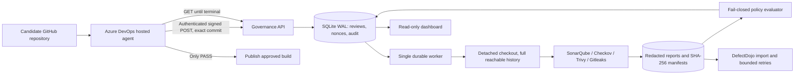

# Architecture and trust boundaries

The API process cannot access the Docker socket. The worker belongs to the Docker group, which is root-equivalent on this single-host MVP; treat it as a trusted control-plane service. Scanner containers receive a read-only checkout, drop capabilities, disallow privilege escalation, and have resource limits. Gitleaks and Checkov have no network. Sonar needs the local service and Trivy needs vulnerability DB access. No repository build scripts execute on the governance host.

SQLite WAL is deliberate for a single-worker, single-host MVP. Writes are transactional, nonce and idempotency keys have uniqueness constraints, and only one worker can acquire its filesystem lock. Horizontal scaling requires moving the queue/state to PostgreSQL and introducing leases. Dojo and Sonar each have their own PostgreSQL databases.

## Identity

The administrator registers repository URLs and authorized ADO project URL prefixes. API credentials map to a repository allowlist and pipeline/read-only roles. A signed request binds the complete body, timestamp, nonce and idempotency key. The server adds the policy digest, fetches the exact commit, and verifies the actual checkout. A separate Sonar project per review avoids accidentally selecting another analysis; the analysis revision must match.

HMAC proves the request came from a holder of the pipeline secret; it is not independent Azure-issued attestation. Pipeline administrators can change YAML or access credentials. Protect the main branch, restrict Pipeline editing, restrict secrets to the intended pipeline, and avoid running untrusted fork builds with secrets. A compromised server/root user can forge results: this MVP does not provide external immutable attestation.

## Decision

Missing, malformed or failed mandatory reports, uncovered inputs, identity mismatch and invalid policy evidence produce ERROR. Valid blocking findings or a failed Sonar Quality Gate produce BLOCK. Only complete, policy-compliant evidence produces PASS. DefectDojo is an asynchronous evidence destination; its availability cannot turn a non-PASS decision into PASS.

## Scope and limitations

The initial pilot covers supported source, Dockerfile/IaC, lock/requirements files, current files and full history reachable from the requested commit. It does not claim dynamic runtime testing, detection of every secret or vulnerability, or examination of unreachable Git objects. Container image scanning and externally fetched modules require explicit extension and digest binding before adoption. Files outside specialized scanner domains still receive secret scanning; the inventory identifies which scanner applies. Unsupported languages and external references require review before onboarding a repository.

No public fault-injection or policy-override endpoint exists. Fault injection requires host administrator access and a commit-bound marker under the root-owned configuration directory.

## Sonar policy

The server provisions `TKE Security Policy` as the default Quality Gate for new review projects. Its exact metric thresholds (`vulnerabilities > 0`, `bugs > 0`) are included in policy-v1 and verified against the analysis response. A mismatch is ERROR. Sonar's analysis API supplies the analyzed file list, which is cross-checked against required source inputs. Shell scripts receive syntax checking and secret scanning; this pilot does not claim shell SAST coverage from Sonar.

Sonar findings preserve their native type and severity. Maintainability issues (`CODE_SMELL`) remain visible and import into Dojo, but do not independently block a security release. Bugs and vulnerabilities are governed by the explicit Sonar gate and security thresholds. This prevents a cognitive-complexity warning from being confused with a security vulnerability; no finding is suppressed or discarded.

Gitleaks retains full reachable-history scanning. The server policy excludes only the exact non-secret template literal `replace-with-32-character-key` from `.env.example`; it does not exempt a path, rule, commit, or arbitrary key. The policy snapshot and digest record this reviewed false positive.
